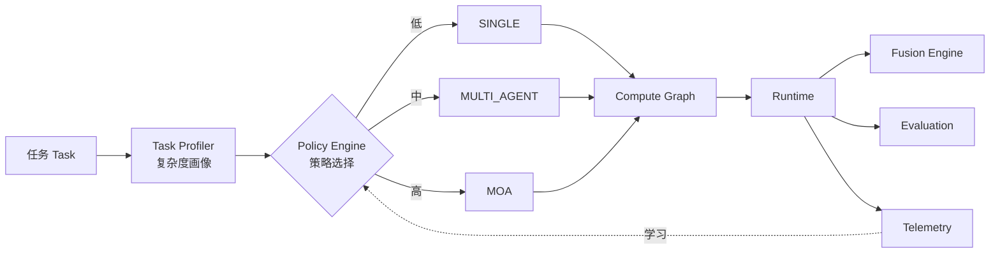

<p align="center">
  
</p>

<p align="center">
  <a href="https://github.com/Yum-wu/fek/actions/workflows/ci.yml"></a>
  
  
  
</p>

# ⚡ FEK · Adaptive AI Execution Engine（自适应 AI 执行引擎）

> **FEK 为每个 AI 任务自动决定：用哪种执行策略最划算。**

你提交一个任务，FEK 自动判断它的复杂度，选择一个执行策略——单模型一次调用、规划+批判的多智能体、还是混合专家（MoA）融合——把它编译成计算图、执行，并从每次运行的成本 / 延迟 / 质量里持续学习、优化未来的选择。

**你只提交任务，不写 Agent、不配工作流、不挑模型。FEK 决定怎么执行。**

---

## 1. 为什么需要 FEK（Why FEK）

今天搭一个"会思考的 AI 系统"，只有两条路，都不完美：

- **手写 Agent / 工作流**（LangGraph / AutoGen / CrewAI）：灵活，但每个任务都用"重"策略，成本和延迟失控。
- **直接调一个强模型**：简单，但简单任务浪费钱、困难任务又不够。

两条路都缺一个东西：**一个能"看任务下菜碟"的执行层**——简单任务用便宜的单次调用，困难任务才上多智能体 / MoA，并且能**量化证明"多花的算力确实换来了更好的结果"**。

FEK 就是这一层。它跑在 Gateway（如 LiteLLM / OpenRouter）**之上**，可嵌入 Agent Framework **之内**——既不是网关，也不是 Agent 框架。

---

## 2. 30 秒看懂

```
问题：这个任务该用单模型还是多智能体？多智能体是不是在瞎花钱？
  │
  ▼
方案：FEK 按复杂度自动选策略，成本/质量/延迟可解释、可量化、可学习
  │
  ▼
Demo：python examples/basic_demo.py   （零 API key，离线可跑）
  │
  ▼
架构：Task Profiler → Policy Engine → Graph Compiler → Compute Graph
       → Runtime（Fusion + Evaluation）→ Telemetry → 学习回流
  │
  ▼
路线：v1 Adaptive Runtime（已落地） → v2 Learning Optimizer（近期）
       研究：Self-Evolving Execution / Autonomous Kernel（不排期）
```

---

## 3. 快速开始（Quick Demo）

```bash
# 克隆
git clone https://github.com/Yum-wu/fek.git
cd fek

# 命令行 Demo —— 完全离线，无需任何 API key
python examples/basic_demo.py
python examples/battle_demo.py        # 三策略成本/质量对战
python examples/learning_demo.py      # 看策略学习曲线

# Web 界面（需 streamlit）
pip install streamlit
streamlit run web/app.py              # http://localhost:8501
```

> **Windows 用户**：双击仓库根目录的 **`start.bat`** 调出菜单，选 [1]~[4] 一键运行 Demo / Web / 测试。

### 作为库使用

```python
from fek import FEKKernel

kernel = FEKKernel()                       # 默认 mock 后端，零 API key
result = kernel.run("对比 Python 和 Go 做后端服务")
print(result.summary())
# [混合专家（MoA）] 复杂度=高（high）(0.82) | 节点数=5 | 融合=True | ...
print(kernel.policy.explain(result.complexity_score))
# 为什么选这个策略：基于复杂度与历史学习偏好
```

**真实 LLM（可选）**：设置 `FEK_MODE=openai` + `OPENAI_API_KEY` 即可接入 OpenAI 兼容端点（包括 Ollama / vLLM / OpenRouter）。详见 `.env.example`。

---

## 4. 核心概念（Core Concepts）

| 概念 | 一句话 |
|---|---|
| **Task Profiler** | 给任务"画像"：估计复杂度 [0,1]（当前为可解释启发式） |
| **Policy Engine** | FEK 的心脏：按复杂度选策略（SINGLE / MULTI_AGENT / MOA），可解释、可学习 |
| **Compute Graph** | 策略编译出的执行计划（DAG），纯数据结构 |
| **Runtime** | 拓扑序执行 Compute Graph，并行、聚合、打分 |
| **Fusion Engine** | 把多个智能体输出聚合成一个答案（MoA 的核心，仅子组件） |
| **Evaluation** | 给输出打质量分 [0,1]（当前启发式占位，未来 LLM 裁判） |
| **Telemetry** | 记录每次运行的成本/延迟/质量，回流 Policy Engine 学习 |

**核心创新**：不是其中任一组件，而是把它们组织成**成本感知、可解释、可学习的执行闭环**（见 `docs/architecture.md` Part 4）。

---

## 5. 架构（Architecture）



权威架构文档：`docs/architecture.md` ｜ 模块 RFC：`docs/rfcs/`

---

## 6. 生态定位（Ecosystem Position）

```
Applications → Agent Frameworks → ▶ Execution Layer (FEK) ◀ → Gateway → SDK → Model
```

FEK 属于 **Execution Layer**：在 Gateway 之上、Agent Framework 之内。它**不是 Gateway**（不代理 token API），**不是 Agent Framework**（你不写 Agent），**不只是 MoA**（MoA 只是多种策略之一）。

完整生态地图与逐项目对比：`docs/ecosystem/ai-infra-landscape.md` ｜ `docs/competitive-analysis.md`

---

## 7. 路线图（Roadmap）

**Product（近期、可交付）**
- ✅ **v1 Adaptive Runtime**：自动策略选择 + 成本感知执行 + Telemetry + mock 可跑
- 🔜 **v2 Learning Optimizer**：学习升级（可切换 bandit）、真实 token 计费、学习可回测

**Research（探索、不排期、不承诺）**
- R1 Self-Evolving Execution（图变异/角色自演化）
- R2 Autonomous Kernel（自主目标分解）
- R3 更好 Task Profiling（嵌入/检索/LLM 自评）——**最高优先级改进**
- R4 真实 LLM 裁判

完整路线图（含非目标）：`docs/roadmap.md` ｜ `VISION.md`

---

## 8. 与其他项目对比（Comparison）

| 项目 | 层 | 与 FEK 关系 |
|---|---|---|
| LiteLLM / OpenRouter | Gateway | FEK 可当其上游调用方 |
| LangGraph / AutoGen / CrewAI | Agent Framework | FEK 可嵌入其节点 |
| MoA (Together AI) | 融合技术 | FEK 的多种策略之一 |

10 个项目详细对比：`docs/competitive-analysis.md`

---

## 9. 愿景（Vision）

FEK 的长期目标是让"如何执行一个 AI 任务"成为**可被优化、可被学习、可被解释的一等公民**——应用只描述任务，FEK 负责怎么跑最划算。

完整愿景、设计原则、非目标：`VISION.md`

---

## 诚实声明（重要）

- **mock 学习层是方法演示**：在 mock 模式下，quality / cost 为启发式，学习曲线展示的是*方法*而非*真实智能*。真实模式才有真实信号。
- **Evaluation 是启发式占位**：当前质量分为玩具级，不可当真；接 LLM 裁判是研究路线（R4）。
- **Task Profiler 是最弱一环**：当前为关键词启发式，正作为最高优先级改进（R3）。

---

## 🧪 测试

```bash
python -m unittest discover -s tests -v
```

CI 在 Python 3.10–3.13 自动跑通（见 `.github/workflows/ci.yml`）。

---

## 🛠️ 开发流程：RFC 驱动

FEK 采用 **RFC-Driven Development**：所有重大设计（新增策略、改模块边界、改公共接口、引入依赖）**先写 RFC，再写代码**。RFC 索引与流程见 `docs/rfcs/README.md`。

---

## 📜 许可证

[MIT](LICENSE) © 2026 FEK Contributors
