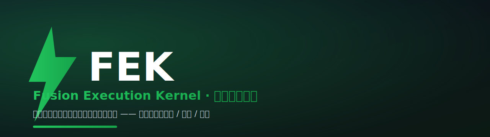
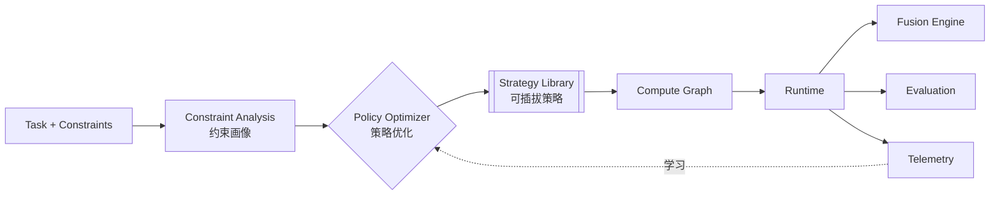

<p align="center">
  
</p>

<p align="center">
  <a href="https://github.com/Yum-wu/fek/actions/workflows/ci.yml"></a>
  
  
  
</p>

# ⚡ FEK · Adaptive AI Compute Optimizer（自适应 AI 计算优化器）

> **FEK 帮你在质量、成本、延迟、隐私等约束下，自动选择最优的 AI 计算策略。**

你提交一个**任务**和一组**约束**（期望质量、预算上限、延迟上限、隐私要求、可接受的模型），FEK 自动分析约束、在策略库中选择（或组合）最优执行策略——单模型、规划+批判、反思、辩论、思维树、MoA、并行……把它编译成执行计划并运行，再从每次运行的成本 / 质量 / 延迟 / 隐私反馈中持续学习、优化未来的选择。

**你只描述"要什么"和"限制是什么"，不写 Agent、不配工作流、不挑模型、也不发明推理策略。FEK 决定怎么算最划算——MoA、Debate、Tree of Thoughts 等都只是可插拔的策略。**

> FEK 的视角是 **Optimization Thinking**，不是 Framework Thinking：我们不比"支持多少 Agent / 多少 MoA"，而是保证"在约束下总能选到最划算的策略"。新出的推理策略会被吸收为可插拔 Strategy，FEK 自身始终停留在更高的策略优化抽象上。

📚 **完整文档导航**：[docs/README.md](docs/README.md) —— 定位 / 架构 / 战略 / 生态 / RFC 一站直达。

---

## 1. 为什么需要 FEK（Why FEK）

今天搭一个"会思考的 AI 系统"，只有两条路，都不完美：

- **手写 Agent / 工作流**（LangGraph / AutoGen / CrewAI）：灵活，但每个任务都用"重"策略，成本和延迟失控；而且 Claude Code 这类工具已经在自动生成工作流，这件事本身已不再是护城河。
- **直接调一个强模型**：简单，但简单任务浪费钱、困难任务又不够。

两条路都缺一个东西：**一个能"看任务下菜碟、且把约束当一等公民"的优化层**——简单任务用便宜的单次调用，困难任务才上多智能体 / MoA，并且能**量化证明"多花的算力确实换来了更好的结果"**，同时满足预算、延迟、隐私硬约束。

FEK 就是这一层。它跑在 Gateway（如 LiteLLM / OpenRouter）**之上**，可嵌入 Agent Framework **之内**——既不是网关，也不是 Agent 框架，更不是工作流编辑器。

---

## 2. 30 秒看懂

```
问题：这个任务在给定约束下该用单模型还是多智能体？多智能体是不是在瞎花钱？
  │
  ▼
方案：FEK 按 (任务 + 约束) 做策略优化，成本/质量/延迟/隐私可解释、可量化、可学习
  │
  ▼
Demo：python examples/basic_demo.py   （零 API key，离线可跑）
  │
  ▼
架构：Task + Constraints → Constraint Analysis → Policy Optimizer
       → Strategy Library（选/组策略）→ Compute Graph → Runtime（Fusion + Evaluation）
       → Telemetry → 学习回流
  │
  ▼
路线：v1 Constraint-aware Optimizer（近期） → v2 Constraint-aware Policy Learning
       → v3 Strategy Marketplace
       研究：约束协商 / 策略组合 / 更好约束理解【最高优先级】 / 真实裁判 / 策略库自扩展
```

---

## 3. 快速开始（Quick Demo）

```bash
# 克隆
git clone https://github.com/Yum-wu/fek.git
cd fek

# 命令行 Demo —— 完全离线，无需任何 API key
python examples/basic_demo.py
python examples/battle_demo.py        # 三策略成本/质量对战
python examples/learning_demo.py      # 看策略学习曲线

# Web 界面（需 streamlit）
pip install streamlit
streamlit run web/app.py              # http://localhost:8501
```

> **Windows 用户**：双击仓库根目录的 **`start.bat`** 调出菜单，选 [1]~[4] 一键运行 Demo / Web / 测试。

### 作为库使用

```python
from fek import FEKKernel
from fek.core.types import Constraints
from fek.learning import create_learner

# ① 默认 mock 后端，零 API key；无约束走原复杂度驱动管线（向后兼容）
kernel = FEKKernel()
r1 = kernel.run("对比 Python 和 Go 做后端服务")
print(r1.summary())

# ② 约束感知（Pivot 已落地）：FEK 在约束下自动选最优策略
r2 = kernel.run(
    "写一份本地隐私报告",
    constraints=Constraints(privacy="local_only", min_quality=0.8),
)
print(r2.summary())

# ③ 约束感知学习闭环（v2 已落地，可选开启）：从运行反馈持续学习策略偏好
kernel_l = FEKKernel(learner=create_learner())
```

> 无约束调用 `run(prompt)` 与历史 Demo / 测试完全兼容；带 `constraints=` 时自动切换为
> `Constraint Analysis → Policy Optimizer → Strategy Library` 新管线。详见
> `examples/constrained_demo.py` 与 `examples/constraint_learning_demo.py`。

**真实 LLM（可选）**：设置 `FEK_MODE=openai` + `OPENAI_API_KEY` 即可接入 OpenAI 兼容端点（包括 Ollama / vLLM / OpenRouter）。详见 `.env.example`。

---

## 4. 核心概念（Core Concepts）

| 概念 | 一句话 |
|---|---|
| **Task + Constraints** | 一等输入：任务描述 + 约束（期望质量 / 预算上限 / 延迟上限 / 隐私要求 / 可接受模型） |
| **Constraint Analysis** | 把 `(Task, Constraints)` 归一化、做可行性校验、按约束筛选候选模型 → 产出 `ConstraintProfile` |
| **Policy Optimizer** | FEK 的心脏：在约束下做策略优化（选 / 组合 Strategy），可解释、可学习 |
| **Strategy Library** | 可插拔策略集（Single / Planner+Reviewer / Reflection / Debate / Tree-of-Thoughts / MoA / Parallel / Hierarchical），均源自已有论文 / 项目；FEK 适配，不重复发明 |
| **Compute Graph** | 被选中的策略编译出的执行计划（DAG），纯数据结构 |
| **Runtime** | 拓扑序执行 Compute Graph，并行、聚合、打分 |
| **Fusion Engine** | 把多个智能体输出聚合成一个答案（MoA 的核心，仅是子组件） |
| **Evaluation** | 给输出打质量分 [0,1]（当前启发式占位，未来 LLM 裁判） |
| **Telemetry** | 记录每次运行的成本 / 延迟 / 质量 / 隐私，回流 Policy Optimizer 学习 |

**核心创新**：不是其中任一组件，而是把它们组织成**约束感知、策略无关、可学习的策略优化闭环**（见 `docs/architecture.md` Part 4）。

---

## 5. 架构（Architecture）



权威架构文档：`docs/architecture.md` ｜ 模块 RFC：`docs/rfcs/`（定位重构见 0010 / 0011 / 0012）

---

## 6. 生态定位（Ecosystem Position）

```
Applications → Agent Frameworks → ▶ AI Compute Optimization Layer (FEK) ◀ → Gateway → Model
```

FEK 属于 **AI Compute Optimization Layer**：在 Gateway 之上、Agent Framework 之内。它**不是 Gateway**（不代理 token API）、**不是 Agent Framework**（你不写 Agent）、**不是 Workflow Builder**、**不是 MoA Framework**——MoA、Debate、Tree-of-Thoughts 等都只是 Strategy Library 里的一个可插拔策略。

完整生态地图与逐项目对比：`docs/ecosystem/ai-infra-landscape.md` ｜ `docs/competitive-analysis.md`

---

## 7. 路线图（Roadmap）

**Product（近期、可交付）**
- 🟢 **v1 Constraint-aware Optimizer（近期）**：`Task + Constraints` 一等输入、Constraint Analysis、Policy Optimizer 在约束下选策略、内置 8 策略的 Strategy Library、Compute Graph / Runtime / Telemetry 可跑、mock 离线可验证
- 🟡 **v2 Constraint-aware Policy Learning**：从真实成本 / 质量 / 延迟 / 隐私反馈学习"约束 → 最优策略"的偏好（当前 ε-greedy bandit 学习层已落地，将扩展为约束感知）
- ⚪ **v3 Strategy Marketplace**：第三方策略可注册、共享、评测、组合

**Research（探索、不排期、不承诺）**
- R1 Constraint Negotiation（约束协商 / 松弛：约束冲突时如何 trade-off）
- R2 Strategy Composition（多策略按需组合）
- R3 更好的约束 / 任务理解（嵌入 / 检索 / LLM 自评）——**最高优先级改进**
- R4 真实 LLM 裁判（替代启发式质量分）
- R5 Strategy Library 自动扩展（从论文 / 仓库自动吸收新策略）

完整路线图（含非目标）：`docs/roadmap.md` ｜ `VISION.md`

---

## 8. 与其他项目对比（Comparison）

| 项目 | 层 | 与 FEK 关系 |
|---|---|---|
| LiteLLM / OpenRouter | Gateway | FEK 可当其上游调用方 |
| LangGraph / AutoGen / CrewAI | Agent Framework | FEK 可嵌入其节点 |
| MoA (Together AI) | 融合技术 / 单一策略 | FEK **Strategy Library** 中的一个可插拔策略 |

10 个项目详细对比：`docs/competitive-analysis.md`

---

## 9. 愿景（Vision）

FEK 的长期目标是让"如何在约束下最优地执行一个 AI 任务"成为**可被优化、可被学习、可被解释的一等公民**——你只描述任务与约束，FEK 负责怎么算最划算。

完整愿景、设计原则、非目标：`VISION.md`

---

## 诚实声明（重要）

- **mock 学习层是方法演示**：在 mock 模式下，quality / cost 为启发式，学习曲线展示的是*方法*而非*真实智能*。真实模式才有真实信号。
- **Evaluation 是启发式占位**：当前质量分为玩具级，不可当真；接 LLM 裁判是研究路线（R4）。
- **Constraint Analysis / 约束理解是最弱一环**：当前为关键词启发式，正作为最高优先级改进（R3）。

---

## 🧪 测试

```bash
python -m unittest discover -s tests -v
```

CI 在 Python 3.10–3.13 自动跑通（见 `.github/workflows/ci.yml`）。

---

## 🛠️ 开发流程：RFC 驱动

FEK 采用 **RFC-Driven Development**：所有重大设计（定位变更、新增策略类型、改模块边界、改公共接口、引入依赖）**先写 RFC，再写代码**。最近合并的关键 RFC：

- **0010** 战略定位重构（Positioning Pivot）—— 由 "Adaptive AI Execution Engine" 演进为 "Adaptive AI Compute Optimizer"
- **0011** 约束感知策略优化器（Constraint-Policy Optimizer）—— `Constraints` / `ConstraintProfile` 一等输入
- **0012** 策略库（Strategy Library）—— MoA 等降为可插拔策略

RFC 索引与流程见 `docs/rfcs/README.md`。

---

## 📜 许可证

[MIT](LICENSE) © 2026 FEK Contributors
