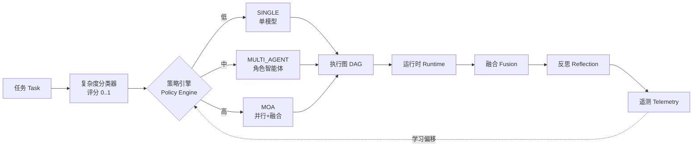

<p align="center">
  
</p>

<p align="center">
  <a href="https://github.com/Yum-wu/fek/actions/workflows/ci.yml"></a>
  
  
  
</p>

# ⚡ FEK · Fusion Execution Kernel（融合执行内核）

> 一个自适应执行内核：把任意任务自动编译成**最优的多模型计算图**，并持续对成本 / 延迟 / 质量做权衡优化。

FEK 不规定 LLM *应该怎么思考*，而是为每个任务**自动选择计算策略**：

```
任务 ──▶ 复杂度分类 ──▶ 策略引擎 ──▶ 图编译器
                                  │
                                  ▼
              执行图(DAG) ──▶ 运行时 ──▶ 融合 ──▶ 反思 ──▶ 遥测
```

三种策略，一个内核：
- **SINGLE** —— 单模型一次调用，便宜且快
- **MULTI_AGENT** —— 基于角色的智能体：规划 → 执行 → 批判 → 综合
- **MOA** —— 混合智能体（Mixture-of-Agents）：并行多模型 + 融合，专治高不确定性任务

---

## ✨ 为什么是 FEK（给开发者）

- **零依赖即可运行**：`mock` 模式下无需任何 API key，克隆下来一条命令就能跑。
- **看得见的"执行智能"**：你能亲眼看到系统*决定*用哪种策略、以及*为什么*（策略引擎自带 `explain()`）。
- **成本感知**：遥测把每种策略的质量 / 延迟 / 成本并排对比（"对战模式"），让"更多算力 ≠ 更好"变成可量化结论。
- **清晰分层、易扩展**：代码结构严格对应 `FEK` 架构，从 v0 平滑演进到 v4。
- **云端零摩擦**：无数据库、无鉴权、无构建步骤，一行命令部署到 Hugging Face / Streamlit Cloud。

---

## 🏗️ 架构



---

## 🚀 快速开始（mock 模式，零 API key）

```bash
# 1. 克隆
git clone https://github.com/Yum-wu/fek.git
cd fek

# 2.（可选）虚拟环境
python -m venv .venv && source .venv/bin/activate

# 3. 命令行 Demo —— 完全离线
python examples/basic_demo.py
python examples/battle_demo.py

# 4.（可选）Web 界面，需要 streamlit
pip install streamlit
streamlit run web/app.py
```

Web 界面在 `http://localhost:8501` 打开，展示实时执行图、自动选择的策略，以及带遥测的三种策略对战。

### 作为库使用

```python
from fek import FEKKernel

kernel = FEKKernel()                       # 默认 mock 后端
result = kernel.run("对比 Python 和 Go 做后端服务")
print(result.summary())                    # [moa] complexity=high (0.82) | nodes=5 fused=True | ...
print(kernel.policy.explain(result.complexity_score))
```

---

## 📦 项目结构

```
fek/
├── fek/                  # 内核包（核心层纯标准库，零第三方依赖）
│   ├── core/             # 类型（Strategy/Complexity/Task）+ 执行图 DAG
│   ├── classifier/       # 复杂度分类器：任务 → 评分 [0,1]
│   ├── policy/           # 策略引擎：评分 → 策略（核心创新点，含 explain()）
│   ├── compiler/         # 图编译器：（策略, 任务）→ 执行图 DAG
│   ├── runtime/          # 执行器：拓扑序执行 DAG
│   ├── fusion/           # MoA 融合层
│   ├── reflection/       # 质量评估器（可接入 LLM 裁判）
│   ├── models/           # LLM 后端抽象 + MockBackend（离线）+ OpenAIBackend
│   ├── telemetry/        # 轨迹记录：成本/延迟/质量 + 可学习偏移
│   └── kernel.py         # FEKKernel —— 唯一编排入口
├── examples/             # basic_demo.py、battle_demo.py
├── web/                  # app.py —— Streamlit 演示界面
├── tests/                # unittest 测试套件（零依赖，15+ 用例）
├── docs/analysis.md      # 设计评估 + MVP 范围建议
├── assets/logo.svg       # README 横幅
├── pyproject.toml        # 打包 / `pip install -e .`
├── requirements.txt
├── .env.example
├── LICENSE               # MIT
├── CODE_OF_CONDUCT.md
├── CONTRIBUTING.md
└── .github/workflows/ci.yml
```

与 `FEK` 统一架构的层级映射：

| FEK 层级 | 本仓库对应 |
|---|---|
| 任务理解 | `classifier` |
| 执行策略（Policy） | `policy`（创新点） |
| 图编译器 | `compiler` |
| 执行运行时 | `runtime`（Python；v4 愿景用 Go） |
| 多智能体融合 | `fusion` |
| 反思 / 评估 | `reflection` |
| 遥测与学习 | `telemetry` |

---

## 🔌 真实 LLM 模式（可选）

设置环境变量（参考 `.env.example`）即可接入 OpenAI 兼容端点：

```bash
export FEK_MODE=openai
export OPENAI_API_KEY=sk-...
export OPENAI_MODEL=gpt-4o-mini
python examples/basic_demo.py
```

任何 OpenAI 兼容服务端都可用（`OPENAI_BASE_URL`），也可接入本地模型（如 Ollama、vLLM）。

---

## ☁️ 部署

- **本地命令行（零依赖）：** `python examples/basic_demo.py`
- **本地 Web：** `pip install streamlit && streamlit run web/app.py`
- **云端（Hugging Face Spaces / Streamlit Community Cloud）：** 推送仓库，入口设为 `web/app.py` 即可。

无数据库、无鉴权、无构建步骤——刻意而为，让任何人在一分钟内跑起来。

---

## 🧪 测试

```bash
python -m unittest discover -s tests -v
```

CI 会在 Python 3.10–3.13 上自动跑通上述测试（见 `.github/workflows/ci.yml`）。

---

## 🗺️ MVP 范围与路线图

已实现（v0 + v1 精华）：
- ✅ 任务 → 复杂度评分 → 策略选择（策略引擎）
- ✅ 按策略动态编译执行图（SINGLE / MULTI_AGENT / MOA）
- ✅ DAG 执行运行时 + MoA 融合
- ✅ 反思 / 质量评分 + 遥测（成本 / 延迟 / 质量）
- ✅ 离线 mock 后端 + 可插拔真实 LLM 后端
- ✅ 带实时图形与对战模式的 Web 界面

路线图（诚实标注，欢迎 PR）：
- 🔜 v2 从轨迹学习策略（仓库已留 `learn()` 桩）
- 🔜 v3 图变异 / 自演化角色
- 🔜 v4 目标分解 / 自主目标
- 🔜 Go 运行时、分布式执行

完整设计评审见 `docs/analysis.md`。

---

## 🤝 如何贡献

欢迎 Issue、PR、点 Star！详见 [CONTRIBUTING.md](CONTRIBUTING.md)。
好的起步任务通常打 `good first issue` 标签：实现 `learn()`、接入真实反思裁判、增加新策略。

---

## 📜 许可证

[MIT](LICENSE) © 2026 FEK Contributors
